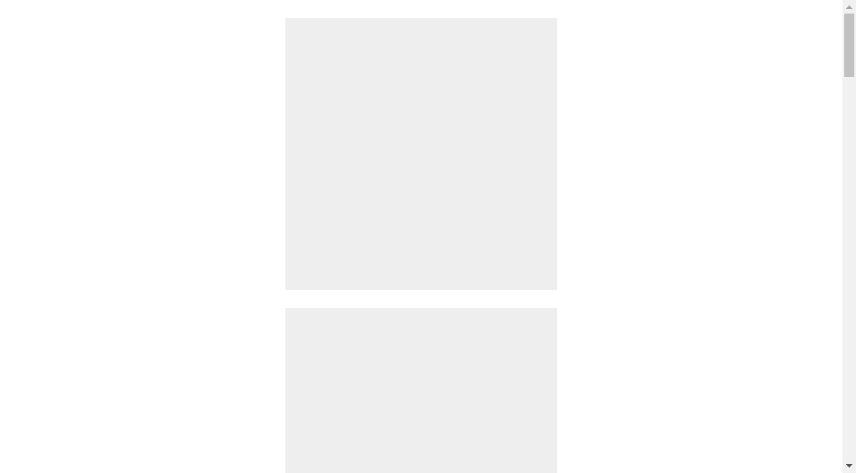

# Arrival

Zero dependency plugin with declarative interface to set classes or apply some styles on elements depending on scroll position.



This component designed to include in project not just copy-past. In example we have 3 types of scroll effects:

* add class
* change `background-color`
* change `transform` and `opacity` properties

It is hard to believe that all this needed to real project, so feel free to leave only what you need.

For this example you could instantiate component like this:

```html
<div data-arrival data-change-translate></node>
```

You can declarative set configuration for particular instance if needed. Ex:

```html
<div data-arrival data-distance="20" data-start="100"></node>
```

Supports: IE9+ (with Babel), Modern browsers.

Copyright © 2017, Dima Nechepurenko. Published under MIT license.
